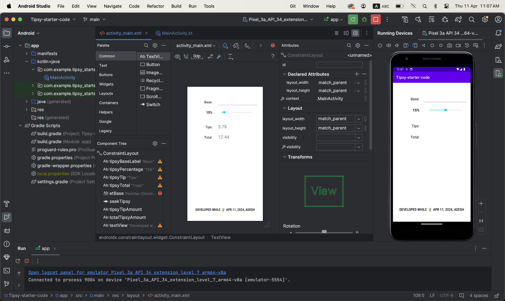
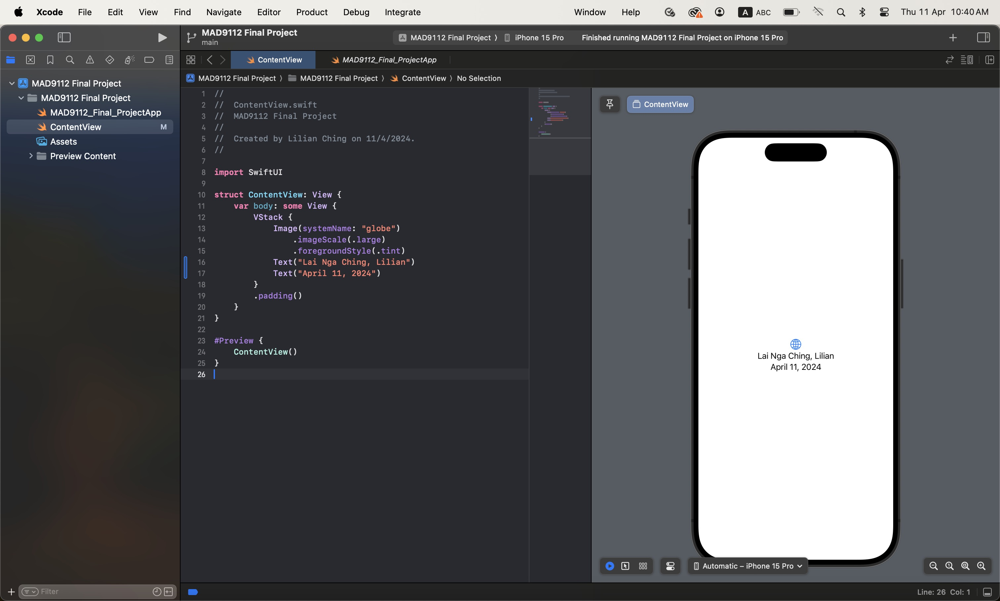

# Lai Nga Ching, Lilian (chin0088)

```
let bmi = null;
function calculateBMI(weight, height){
    bmi = weight / Math.pow(height, 2);
    return bmi;
}

function interpretBMI(bmi){
    let results = null;
    if(bmi < 18.5){
        results = "Underweight";
    } else if(bmi === 18.5 || bmi < 25) {
        results = "Normal weight"
    } else if(bmi === 25 || bmi < 30){
        results = "Overweight"
    } else {
        results = "Obese"
    }
    return results;
}

console.log(calculateBMI(90, 1.91));
console.log(interpretBMI(bmi));
```



